# 스타법무 법인 SW 개발파트 사전과제

 

안녕하세요 사전과제 전형 면접자 김지호 입니다. 
저는 이번 과제에서 밑의 3가지 레퍼런스 중 토스 팀 소개 페이지를 기반으로 웹페이지를 제작하였습니다. 
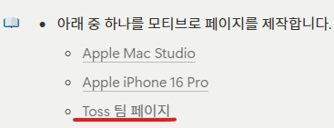
 
기존 토스 팀 소개 홈페이지 디자인을 그대로 가져오는 대신 새로운 애니메이션(인터렉션) 과 추가 섹션을 더해 제작하였습니다

- 개발 언어 : Typescript & React
- 개발 환경 : Next.js 14
- UI 스타일링 : emotion & SCSS
- 컴포넌트 관리 및 테스트 : Storybook
- 클라이언트 상태관리 : zustand
- 사용 DB : Firebase
- 테스트 : Jest + RTL
- 형상관리 : github
- 배포 : vercel
- API요청 : axios + msw
   
   

## 실행방법

git clone >> npm install >> npm run dev
 

## 홈페이지 Preview

주소 : https://starlawfirm-test.vercel.app/
 
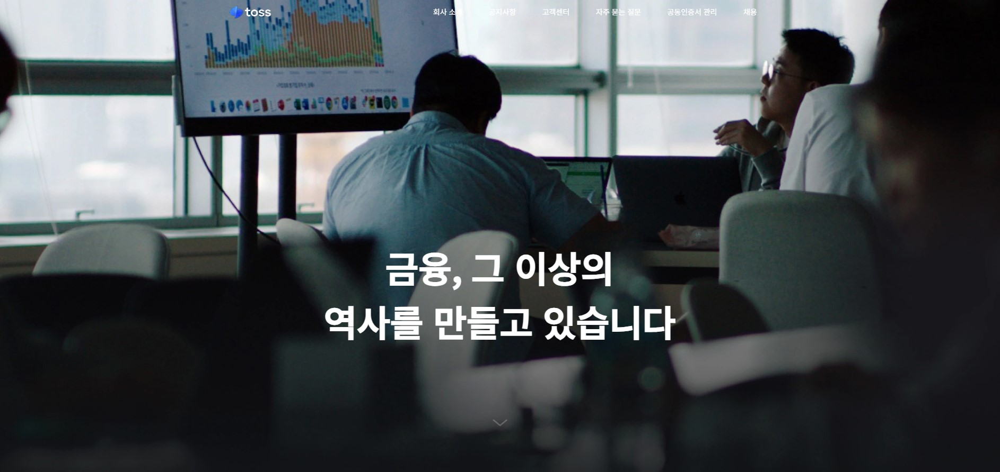

## directory map

  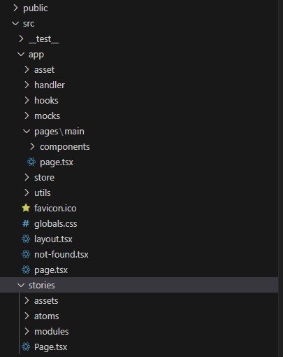
   
  스토리북 안의 컴포넌트 설계는 아토믹 디자인 패턴을 기반으로 가장 기초 컴포넌트 atoms을 제작 하였으며 atom들이 모여 modules가 되도록 제작하였습니다.

## test preview

  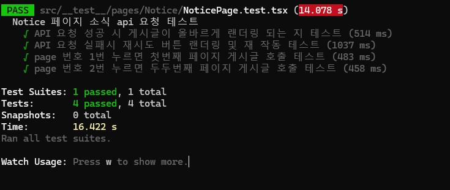
  jest를 통한 테스트는 작성한 코드가 의도대로 진행되는지와 api요청을 매번 할 수 없는 상황일 때 
  api요청 시뮬레이션을 하여 성공과 실패할 시 올바른 return이 나오는지 테스트 하는 것으로 생각하고 있습니다

### 📌 주요기능

이번 과제에선 섹션마다 보여드리고 싶은 기술들을 각자 다르게 잡았으며 하나씩 소개 해드리겠습니다.

첫번째 섹션 : (애니메이션) 요즘 웹페이지에서 가장 대중적이게 많이 쓰이는 애니메이션 인터렉션을 구현하였습니다. 
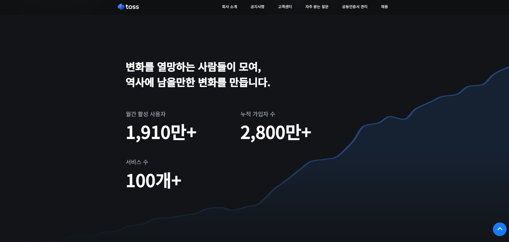
두번째 섹션 : (애니메이션) svg animation을 그대로 가져왔으며 첫번째 섹션과 마찬가지로 대중적이게 많이 쓰이는 인터렉션을 구현하였습니다. 
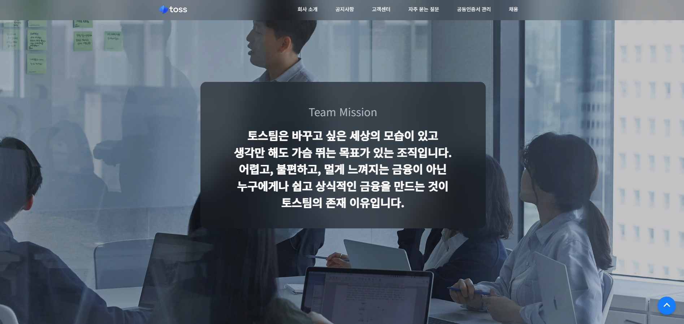
세번째 섹션 : (스크롤) 해당 섹션에서는 레퍼런스 페이지의 스크롤 인터렉션을 라이브러리를 쓰지않고 직접 구현하였습니다. 
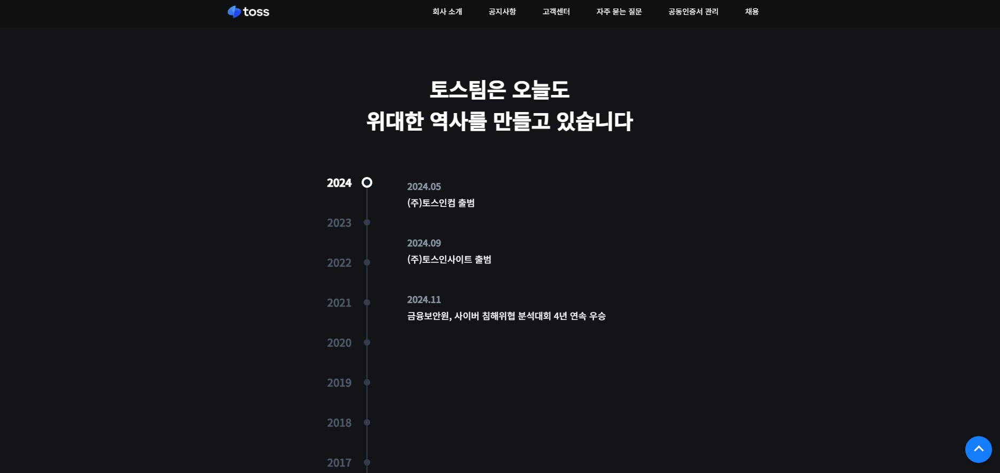
네번째 섹션 : (State 활용) 해당 섹션에서는 History를 보여주는 섹션입니다. history연도를 클릭시 state를 조정하여 내부 데이터를 조정하였습니다. 
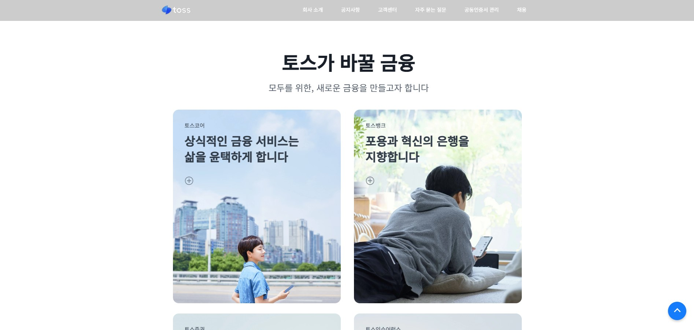
다섯번째 섹션 : (State 활용) 토스 그룹의 여러 계열사를 소개 하는 섹션 입니다. 네번째 섹션과 마찬가지로 state 활용을 한 섹션입니다. 
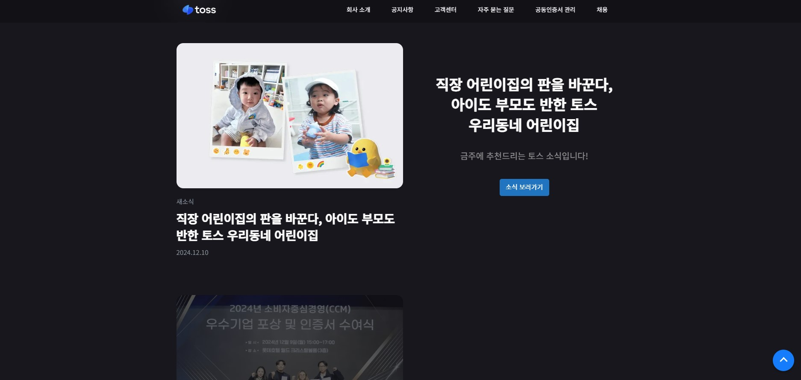
여섯번째 섹션 : (스크롤) 금주의 토스 소식이라고 제가 직접 추가한 섹션 입니다. 해당 섹션에서는 스크롤 이벤트를 이용하여 스크롤이 게시글에 도달했을 때 이미지가 켜지는 효과를 구현했습니다. 
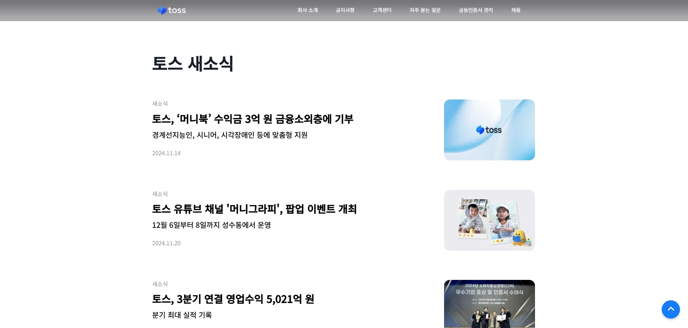
일곱번째 섹션 : (api 통신) 해당 섹션에서는 msw라는 api 시뮬레이션 라이브러리를 이용하여 API 통신을 가정하여 게시글을 API 요청을 통해 가져오는 함수를 구현 하였습니다.
  
해당 함수의 테스트 코드도 작성 하였습니다. 
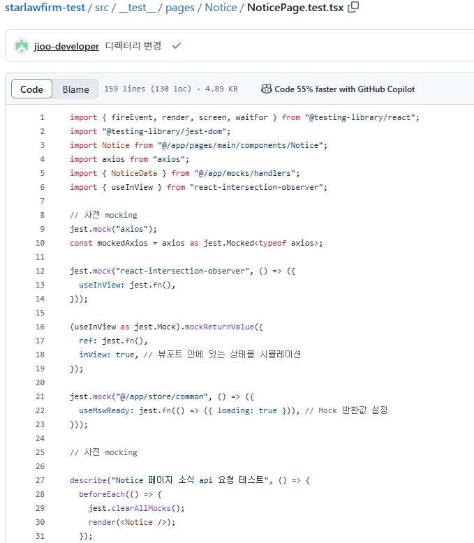
