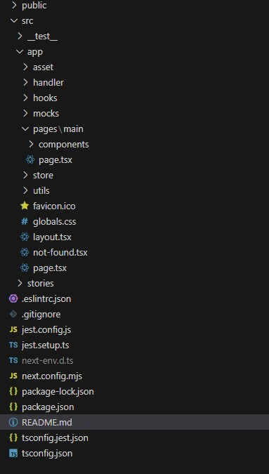

# 스타법무 법인 SW 개발파트 사전과제 Read Me

 

안녕하세요 사전과제전형 면접자 김지호 입니다.
저는 이번 과제에서 밑의 3가지 레퍼런스 중 토스 팀 소개 페이지를 기반으로 웹페이지를 제작하였습니다.
기존 토스 팀 소개 홈페이지 디자인을 그대로 가져오는 대신 새로운 애니메이션(인터렉션) 과 추가 섹션을 더해 제작하였습니다

- 개발 언어 : Typescript & React
- 개발 환경 : Next.js 14
- UI 스타일링 : emotion & SCSS
- 컴포넌트 관리 및 테스트 : Storybook
- 클라이언트 상태관리 : zustand
- 사용 DB : Firebase
- 테스트 : Jest + RTL
- 형상관리 : github
- 배포 : vercel
- API요청 : axios + msw
   
   

## 실행방법법

git clone >> npm install >> npm run dev
 

## Preview

  

## directory map

  

## test preview

  

### 📌 주요기능

이번 과제에선 섹션마다 보여드리고 싶은 기술들을 각자 다르게 잡았으며 하나씩 소개 해드리겠습니다.

첫번째 섹션 : (애니메이션) 요즘 웹페이지에서 가장 대중적이게 많이 쓰이는 애니메이션 인터렉션을 구현하였습니다.
두번째 섹션 : (애니메이션) 토스 페이지의 svg animation을 그대로 가져왔으며 첫번째 섹션과 마찬가지로 대중적이게 많이 쓰이는 인터렉션을 구현하였습니다.
세번째 섹션 : (스크롤) 해당 섹션에서는 토스 팀 소개 페이지의 스크롤 인터렉션을 라이브러리를 쓰지않고 그대로 직접 구현하였습니다.
네번째 섹션 : (State 활용) 해당 섹션에서는 History를 보여주는 섹션입니다. history연도를 클릭시 state를 조정하여 내부 데이터를 조정하였습니다.
다섯번째 섹션 : (State 활용) 토스 그룹의 여러 계열사를 소개 하는 섹션 입니다. 네번째 섹션과 마찬가지로 state 활용을 한 섹션입니다.
여섯번째 섹션 : (스크롤) 금주의 토스 소식이라고 제가 직접 추가한 섹션 입니다. 해당 섹션에서는 스크롤 이벤트를 이용하여 스크롤이 게시글에 도달했을 때 이미지가 켜지는 효과를 구현했습니다.
일곱번째 섹션 : (api 통신) 해당 섹션에서는 msw라는 api 시뮬레이션 라이브러리를 이용하여 API 통신을 가정하여 게시글을 API 요청을 통해 가져오는 함수를 구현 하였고 해당 함수의 테스트 코드도 구현하였습니다.

jest를 통한 테스트는 작성한 코드가 의도대로 진행되는지와 api요청을 매번 할 수 없는 상황일 때 api요청 시뮬레이션을 하여 성공과 실패할 시 올바른 return이 나오는지 테스트 하는 것으로 생각하고 있습니다
